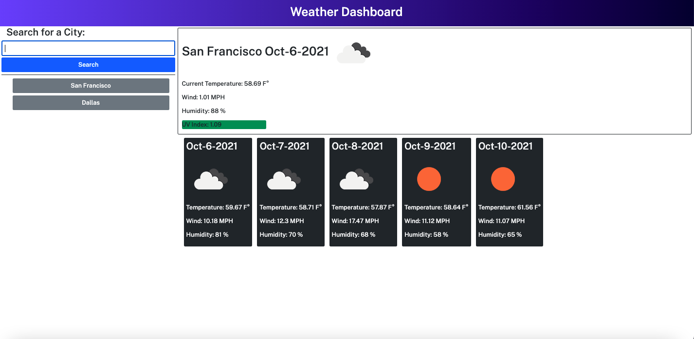
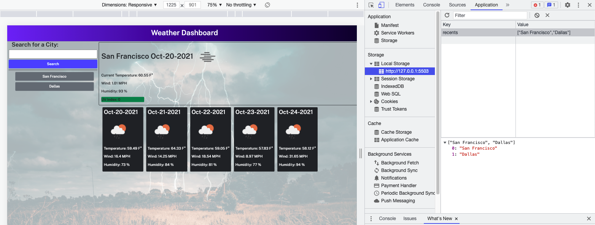

# Weather_Dashboard

## Description

- What was my motivation? I needed to create an application using a third-party API, which could check the weather conditions in specific cities for potential journeys.
- Why did I build this project? I built this project to better understand how to implement third-party APIs. I also needed practice using JavaScript, OpenWeather One Call API, Google Fonts, and Bootstrap.
- What problem does it solve? This project creates a weather application, which finds pertinent data about weather conditions in specific cities.
- What did I learn? I learned about OpenWeather One Call API, Bootstrap, JavaScript, and Google Fonts.

## Table of Contents

- [Installation](#installation)
- [Usage](#usage)
- [Credits](#credits)
- [License](#license)
- [Links](#links)

## Installation

Although this is simply a webpage and no installation is necessary, there were certain criteria that had to be met in order to complete this project:

    User Story

    AS A traveler
    I WANT to see the weather outlook for multiple cities
    SO THAT I can plan a trip accordingly

    Acceptance Criteria

    GIVEN a weather dashboard with form inputs
    WHEN I search for a city
    THEN I am presented with current and future conditions for that city and that city is added to the search history
    WHEN I view current weather conditions for that city
    THEN I am presented with the city name, the date, an icon representation of weather conditions, the temperature, the humidity, the wind speed, and the UV index
    WHEN I view the UV index
    THEN I am presented with a color that indicates whether the conditions are favorable, moderate, or severe
    WHEN I view future weather conditions for that city
    THEN I am presented with a 5-day forecast that displays the date, an icon representation of weather conditions, the temperature, the wind speed, and the humidity
    WHEN I click on a city in the search history
    THEN I am again presented with current and future conditions for that city

## Usage

Please see below for examples of this webpage, which demonstrate its functionality:

### Search Functionality View

### Saved Local Storage View

## Credits

- https://getbootstrap.com/
- https://fonts.google.com/
- https://javascript.info/
- https://du.bootcampcontent.com/denver-coding-bootcamp/du-den-virt-fsf-pt-08-2021-u-c/-/tree/master/06-Server-Side-APIs/02-Homework
- https://coding-boot-camp.github.io/full-stack/github/professional-readme-guide
- https://unsplash.com/

## License

© 2021 Trilogy Education Services, LLC, a 2U, Inc. brand. Confidential and Proprietary. All Rights Reserved.

## Links

[Live Link](https://carlincb.github.io/Weather_Dashboard/)

[GitHub Link](https://github.com/carlincb/Weather_Dashboard)
